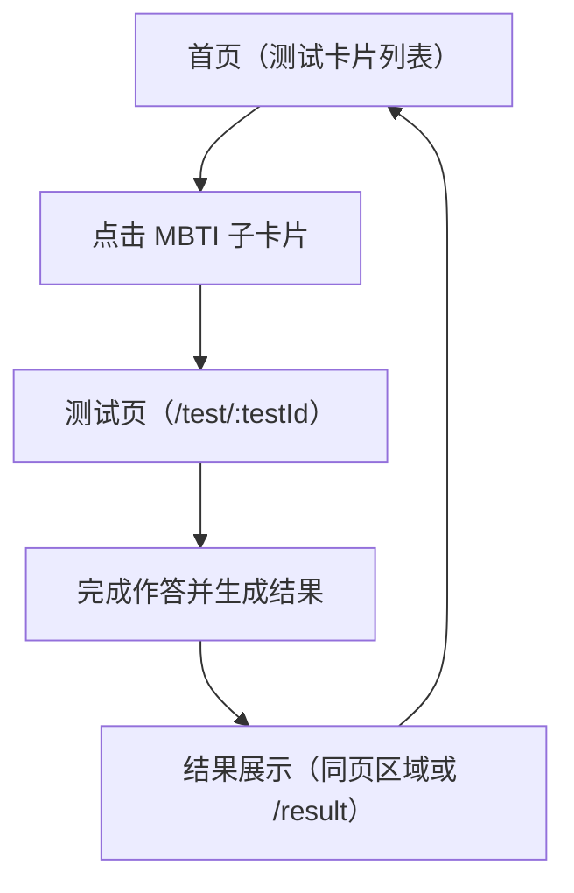

## 1. Product Overview
将首页改为“测试卡片列表”展示入口；用户点击“MBTI 子卡片”进入测试页，并支持后续通过配置扩展更多测试卡片。

## 2. Core Features

### 2.1 Feature Module
本次需求由以下页面构成：
1. **首页（测试卡片列表）**：卡片列表展示、卡片结构（含子卡片）、子卡片点击跳转到测试页、为新增测试卡片预留扩展位。
2. **测试页（通用测试容器）**：根据 testId 加载对应测试内容、展示题目与作答、生成并展示结果、返回首页。

### 2.3 Page Details
| Page Name | Module Name | Feature description |
|---|---|---|
| 首页（测试卡片列表） | 卡片列表 | 展示测试卡片列表（如“MBTI 测试”卡片）。支持按配置渲染多张卡片，后续新增测试只需新增配置数据即可出现在列表中。 |
| 首页（测试卡片列表） | 测试卡片结构 | 渲染卡片基础信息：标题、简介/副标题、封面/图标（可选）、标签（可选）、主按钮区（可选）。 |
| 首页（测试卡片列表） | 子卡片（MBTI 入口） | 在“MBTI 测试”卡片内展示一个或多个子卡片（如不同版本/题量的 MBTI）。 |
| 首页（测试卡片列表） | 子卡片跳转 | 点击子卡片时跳转到测试页路由（携带 testId，如 `mbti` 或 `mbti-93`），并在新页加载对应测试内容。 |
| 测试页（通用测试容器） | 测试加载 | 根据路由参数 testId 解析并加载对应测试配置（标题、题目、计分规则/结果映射）。当 testId 不存在时，展示“测试不存在/返回首页”。 |
| 测试页（通用测试容器） | 作答与进度 | 按题目顺序展示并收集答案；提供基本进度提示（当前题/总题数）。 |
| 测试页（通用测试容器） | 结果展示 | 依据测试配置的规则计算结果并展示；提供“重新开始/返回首页”。 |

## 3. Core Process
- 你打开首页，看到按卡片形式排列的测试入口列表。
- 你在“MBTI 测试”卡片中选择一个 MBTI 子卡片入口。
- 系统跳转到测试页并加载该 testId 对应的题目。
- 你完成作答后在同一测试页看到结果；你可以重新开始或返回首页。

