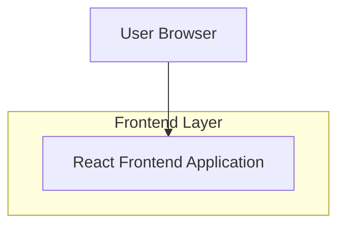

## 1.Architecture design


## 2.Technology Description
- Frontend: React@18 + react-router + tailwindcss@3 + vite
- Backend: None

## 3.Route definitions
| Route | Purpose |
|---|---|
| / | 首页：展示测试卡片列表与子卡片入口 |
| /test/:testId | 测试页：根据 testId 加载测试、作答、展示结果 |

## 6.Data model(if applicable)
### 6.1 Data model definition
（本次不引入数据库；测试与卡片使用前端配置驱动。）

**建议的前端配置结构（用于“可扩展更多测试卡片”）：**
- `TestCatalog`：首页卡片列表数据源
- `TestDefinition`：单个测试的定义（题目、选项、计分/结果映射）

TypeScript 示例：
```ts
type TestCatalogCard = {
  id: string;                 // 如 "mbti"
  title: string;              // 如 "MBTI 测试"
  description?: string;
  coverUrl?: string;
  tags?: string[];
  subCards: Array<{
    id: string;               // 如 "mbti-93"
    title: string;            // 如 "MBTI（93题）"
    description?: string;     // 如 "更精细结果"
    testId: string;           // 路由参数：/test/:testId
    estimatedMinutes?: number;
    badge?: string;           // 如 "推荐" / "新版"
  }>;
};

type TestDefinition = {
  testId: string;
  title: string;
  questions: Array<{
    id: string;
    prompt: string;
    options: Array<{
      id: string;
      label: string;
      // 计分字段：由具体测试自行定义
      score: Record<string, number>;
    }>;
  }>;
  // 结果计算：根据测试类型实现一个 evaluator（前端函数映射）
  evaluatorKey: string;
};
```

**扩展策略（新增测试卡片/子卡片）：**
1) 在 `TestCatalog` 增加一张新卡片，或给现有卡片增加 `subCards`。
2) 为每个 `testId` 增加对应的 `TestDefinition` 配置。
3) 如果新测试的计算逻辑不同，新增一个 `evaluatorKey -> evaluator function` 的映射实现；路由与页面无需改动。